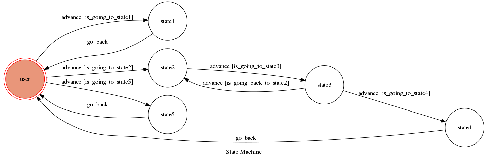

# TOC-project-2017

## Finite State Machine

## Usage
The initial state is set to `user`.

* user
	* Input: "hi" or "hello"
		* Reply: "Hello\n to get  a Verification Code enter : get Code\nto resend enter :resend"

	* Input: "get code"
		* Reply: "E-mail please"
			* Input: E-mail
				* Reply:"Is E-Mail correct ?"
					* Input: "yes"
						*Reply:"Send to E-mail"
					* Input: "no"
						*Reply:"E-mail please"
	
	* Input: "resend"
		*Reply:"Resnd to E-mail"